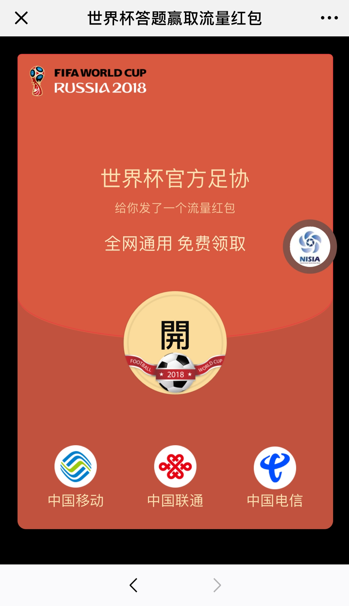

## 废话

在等着西班牙和俄罗斯的加时赛时，翻一翻朋友圈里一妹子分享了类似这样一条链接（下图是后补的，妹子知道后自己删了...）


平时较少点开这种，但是这次因各种原因点开了（至于原因~自己猜 :joy: ），因此也就有了本文。


## 起疑

点开后是这样的



习惯性的看了一下链接地址,来自h5.manhua.163.com,看着挺具有可信度的，差点就被蒙混过关了...


按照上面的步骤一步步进行，到后面会连续让我分享并且最后还要分享到朋友圈，我还真就这样一步步的做了。。。

一共三个地方让我对此产生了怀疑（应该可以说四个，第四个后面再说）

- 一共需分享了4次，其中3次群，1次朋友圈，其中第三次分享会假装提示分享失败；（分享失败的提示是不能分享在同一个群，而我一直分享给同一个人）
- 全部操作完成之后会提示：请等待客服审核领奖，并且要求在朋友圈保持该分享24小时以便审核；（我当时第一反应就是：客服小姐姐得要加我微信么  :laughing:）
- 经过两次点开这个分享后，50%概率会出现第一次剩余的奖品数量小于第二次剩余的奖品数量，而我第二次打开就是那50%（很遗憾，我决定要抓包看看到底是什么鬼...）


## 抓包分析

抓包定位链接


其中，上图的两个请求让我产生了好奇

```
http://api.tlwh.top/ceshi/jump.php
http://r-p-s-have.oss-cn-shenzhen.aliyuncs.com/go.js
```

点进去一看，这个jump.php返回的地址就是我们微信里看到的地址。。。


再看go.js


这些请求的Referer都是 `http://www.zcool.com.cn/...`

再看这个zcool返回的数据


看到这里应该都了然了~

其实，该作者是利用www.zcool.com.cn的存储xss?(**这个zcool相关人员自己定位分析一下吧**)，然后请求了

http://r-p-s-have.oss-cn-shenzhen.aliyuncs.com/go.js 而这个go.js 继续利用ajax技术请求了http://api.tlwh.top/ceshi/jump.php ，如果ajax请求成功返回，我们的页面就会顺着返回的内容跳转过去。

就这样结束了？然而并不是...无利不起早嘛

之前说的第四个起疑，回头看自己分享到群(个人)


这就尴尬了，还好没发到群里...不然岂不是大家都以为我秒射王了...

看来这顺带扩散上面羞羞的链接才是作者真正要做的...（这个链接里是什么暂放一放，先来分析一下他是怎么做到的）

按图索骥：

```
https://h5.manhua.163.com/%02%05%09%03%01%07%02%03%08%08%04%09%03%07%03%07%04%08source%14%16%11%14%19%16%16%11%13%13%15%15%11%14%18%13%15%11/5304164994120004248?id=Hjxz&remote=1&out=js&case=4g&_c=9527&now=1529634068
```

链接中`https://w-o-r-l-d.oss-cn-qingdao.aliyuncs.com/f.js`


不一一截图了，依次请求顺序

```
w-o-r-l-d.oss-cn-qingdao.aliyuncs.com/j.js
w-o-r-l-d.oss-cn-qingdao.aliyuncs.com/secret.html
w-o-r-l-d.oss-cn-qingdao.aliyuncs.com/assets/appx3.js
api.tlwh.top/ceshi/dataapi.php [关键]
...
```


格式化


上面选中的就是关于秒射的分享描述（话说回头看比赛发现克罗地亚和丹曼都1:1了。。。射球怎么这么快。。。）

这里应该算是微信的bug了。。。

不继续水下去了，看球赛~看球赛~看球赛~

这个抓包记录，相关人员或感兴趣的小伙伴可以拿去研究

[burp data](https://github.com/fish0il/misc/blob/master/%E7%AE%80%E5%8D%95%E5%88%86%E6%9E%90%E5%88%A9%E7%94%A8%E4%BA%BA%E6%80%A7+XSS%E5%9C%A8%E5%BE%AE%E4%BF%A1%E6%9C%8B%E5%8F%8B%E5%9C%88%E4%BC%A0%E6%92%AD%E7%9A%84%E6%81%B6%E6%84%8F%E9%93%BE%E6%8E%A5/%E4%B8%96%E7%95%8C%E6%9D%AF%E7%AD%94%E9%A2%98%E8%B5%A2%E5%8F%96%E6%B5%81%E9%87%8F%E7%BA%A2%E5%8C%852.burp.data?raw=true)


##其它

涉及收款二维码

```
https://res.wx.qq.com/mmbizwap/zh_CN/htmledition/images/pic/appmsg/pic_reward_qrcode.2x3534dd.png
```


最后想问一下这个不会是还在测试阶段吧？很抱歉~
